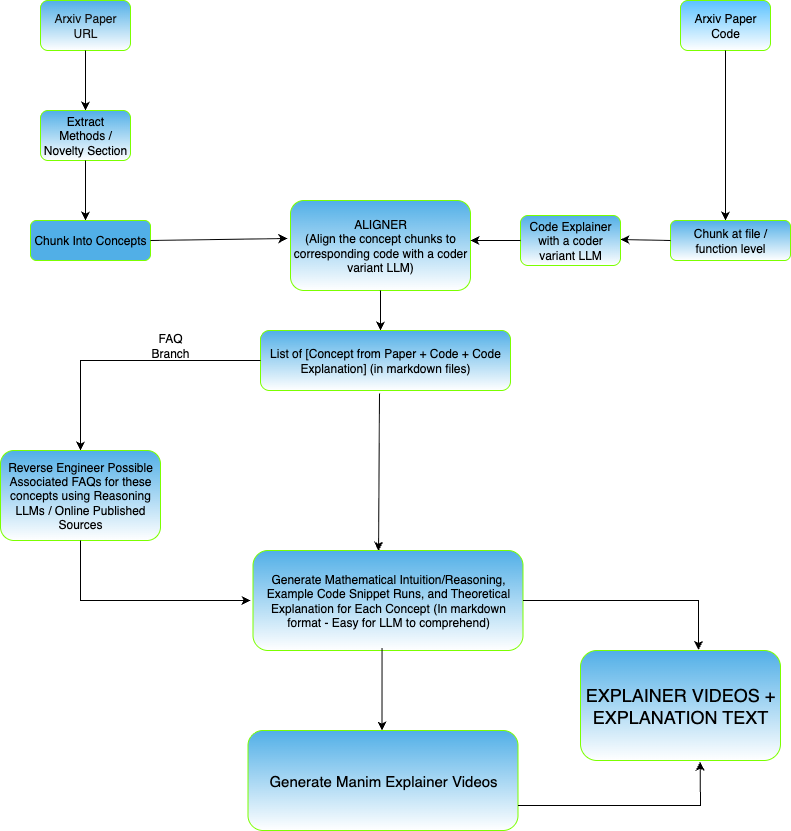

# Grokipedia For Research

> *Democratizing cutting-edge AI research for the world—one animated explanation at a time.*

---

## Why?

### 🌍 Research Belongs to Everyone

Research is one of humanity's most powerful engines of progress—yet it remains locked behind walls of jargon, paywalls, and assumed expertise. We believe there's no better place to democratize research than **XAI's truth-seeking platform, Grok**. 

Grokipedia is built on the principle that understanding should flow freely. By transforming dense academic papers into engaging, accessible content, we're not just explaining research—we're **unlocking potential** in every curious mind that encounters it.

---

### 🎬 Breaking the Jargon Barrier with Visual Learning

Research papers are notoriously difficult to parse. Terms like *"Mixture of Experts routing"*, *"Rotary Positional Embeddings"*, and *"auxiliary load balancing losses"* can make brilliant ideas feel impenetrable.

**Our solution: Transform complexity into clarity through engaging video explanations.**

We leverage **Manim**—the mathematical animation engine created by 3Blue1Brown—to create beautiful, step-by-step animated explanations that:

- 📊 **Visualize abstract concepts** like attention mechanisms and expert routing
- 🔢 **Animate mathematical derivations** so formulas come alive
- 🧩 **Build intuition progressively** from simple analogies to full technical depth
- 💡 **Show code in context** with highlighted implementations

**Plus comprehensive text summaries** that include:
- Core intuitions and analogies
- Mathematical deep dives with LaTeX equations
- Code walkthroughs with worked examples
- Key takeaways and common pitfalls

*Example: Our DeepSeek MoE explainer generates 12+ animated FAQ videos and detailed summaries covering everything from forward pass architecture to RoPE embeddings.*

---

### 🚀 From Theory to Code: The Elite Understanding

What separates a **good understanding** of research from an **elite understanding**?

> *The ability to not just comprehend the theory, but to translate it into working code.*

Most explanations stop at the paper. We go further.

**Our pipeline bridges theory and implementation:**

```
📄 Research Paper (LaTeX)
    ↓
🔍 Semantic Chunking (AI-powered section extraction)
    ↓
🔗 Code Alignment (Maps paper concepts → actual implementation)
    ↓
🎥 Manim Video Generation (Animated explanations with code)
    ↓
📝 Comprehensive Summaries (Math + Code + Intuition)
    ↓
❓ FAQ Deep Dives (Real questions, animated answers)
```

**What we deliver for each paper:**

| Output | Description |
|--------|-------------|
| **Extracted Sections** | Clean markdown from LaTeX papers |
| **Semantic Chunks** | AI-split coherent concept units |
| **Code-Aligned Chunks** | Paper concepts linked to actual code |
| **Animated Videos** | Manim visualizations per concept |
| **Chunk Summaries** | Deep educational markdown documents |
| **FAQ Videos** | Animated answers to common questions |
| **FAQ Summaries** | Comprehensive Q&A reference guides |

---

### 🛠️ The Technical Pipeline

Our codebase is a fully automated research-to-video pipeline:

```python
# 1. Extract sections from LaTeX papers
latex_section_extractor.py  →  introduction.md, architecture.md, ...

# 2. Semantically chunk content using LLMs
semantic_chunker.py  →  chunk_01_overview.md, chunk_02_mechanism.md, ...

# 3. Align paper chunks with code implementations
code_chunk_aligner.py  →  chunks-with-code/*.md (theory + implementation)

# 4. Generate Manim animations for each concept
chunk_video_generator.py  →  video.mp4, manim_code.py, texts/, images/

# 5. Create detailed educational summaries
chunk_summary_generator.py  →  *_summary.md (intuition + math + examples)

# 6. Process FAQs into videos and summaries
faq_video_generator.py  →  faq_combined_video.mp4
faq_summary_generator.py  →  comprehensive_summary.md
```

**Powered by:**
- 🤖 **Large Language Models** with strong mathematical reasoning capabilities
- 🎨 **Manim Community Edition** for mathematical animations
- 🔗 **LLM-powered alignment** to connect theory and code

---

### 💡 See It In Action

Our proof-of-concept: **DeepSeek MoE Explainer**

From a single research paper + codebase, we generated:
- ✅ 12 semantic chunks with code alignment
- ✅ 12 animated Manim videos explaining each concept
- ✅ 12 comprehensive chunk summaries with math + code
- ✅ 1 combined FAQ video (all 12 questions animated)
- ✅ 1 comprehensive FAQ summary (34KB educational document)

**Topics covered include:**
- Mixture of Experts architecture
- Fine-grained expert segmentation
- Shared expert isolation
- Load balancing mechanisms
- RoPE embeddings and context extension
- Forward pass implementation details

---

### 🎯 The Vision

**Today:** Transform individual papers into educational content.

**Tomorrow:** A platform where anyone can:
- Upload papers and code to collections
- Auto-generate educational video series
- Contribute to a growing library of research explanations
- Learn cutting-edge AI from first principles to implementation

**Post to Grokipedia. Democratize knowledge. Change the world.**

---

## Architecture


